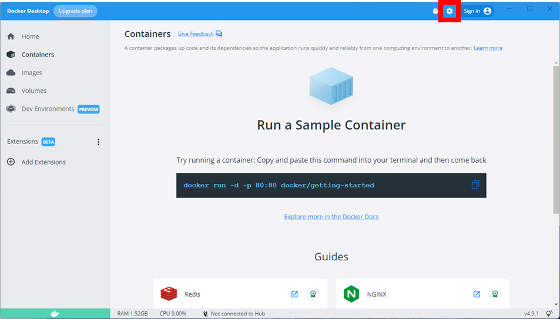
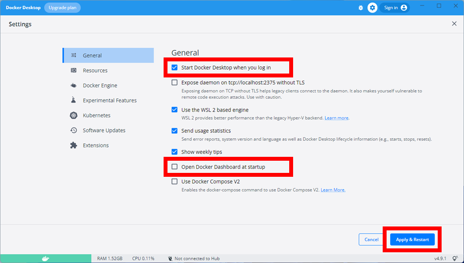
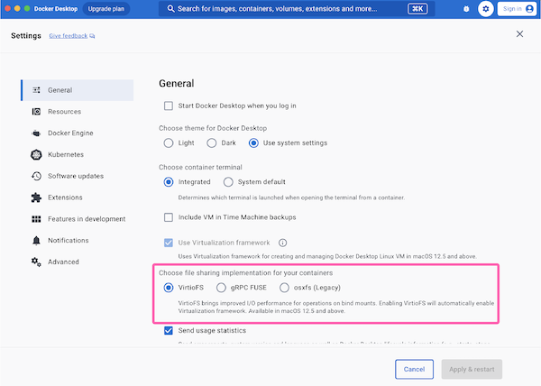
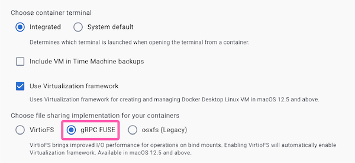
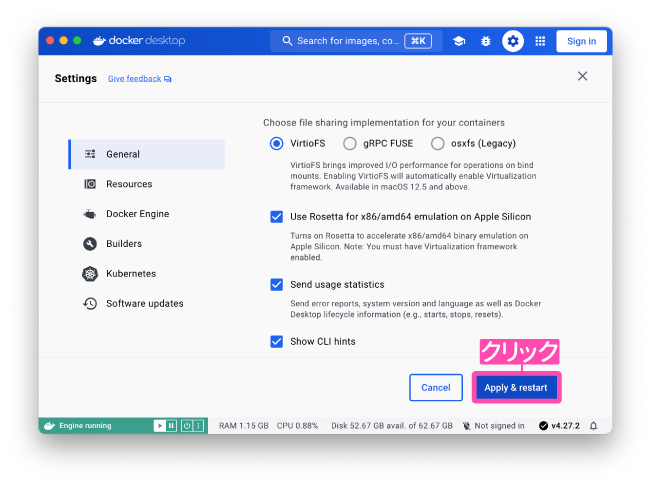

# Docker 関連のトラブル

---
**目次**

- [(1) Docker Desktop がインストールできない](#1)
- [(2) docker compose up -d（コンテナ起動）で失敗する](#2)
- [(3) (winpty) docker compose exec app bash で失敗する](#3)
- [(4) PostgreSQL のバージョンを上げるとデータベースのコンテナの起動に失敗する](#4)
- [(5) npx prisma で失敗する。または Intel MacBook にて Docker を利用していると Segmentation fault と表示される。](#5)
- [(6) `yarn add prisma@4.11.0` で失敗する](#6)
- [(7) M シリーズ Mac にて Docker コンテナ立ち上げ時に警告が出る](#7)

---

## (1) Docker Desktop がインストールできない <a id="1"></a>

### 問題詳細

コンピュータの記憶容量の残りが十分あるにもかかわらず、Docker Desktop がインストールできない場合があります。

### 原因

OS が Docker が対応していない古いバージョンであることが原因です。
Docker が対応している OS のバージョンは、次の通りです（2021.7.12 最終確認）。

- macOS（Intel の CPU を搭載する端末）：**バージョン 10.14（Mojave）以降**
- macOS（Apple silicon を搭載する端末）：**Rosetta 2 がインストールされていること**
  - 以上 2 つは、[Docker のヘルプページ](https://docs.docker.com/docker-for-mac/install/#system-requirements)の内容に基づきます。
- Windows：Windows 10（詳細なバージョンは [Docker のヘルプページ](https://docs.docker.com/docker-for-windows/install/#system-requirements)を参照してください。Windows の Edition（例えば Windows 10 Home や Windows 10 Pro など）によってバージョンが異なります。）

### → 解決方法

OS のアップデートを試してください。

- macOS をお使いの方は、[Apple のサポートページ](https://support.apple.com/ja-jp/HT201541)を参照してください。
- Windows をお使いの方は、[Microsoft のサポートページ](https://support.microsoft.com/ja-jp/windows/windows-10-%E3%82%92%E6%9B%B4%E6%96%B0%E3%81%99%E3%82%8B-3c5ae7fc-9fb6-9af1-1984-b5e0412c556a)を参照してください。

なお、今後も OS のバージョンが古くなると、Docker が動かなくなる可能性があります。OS はこまめにアップデートすると良いでしょう。

<br>

## (2) `docker compose up -d` （コンテナ起動）で失敗する<a id="2"></a>

### 問題詳細

Docker Desktop のインストールには成功したものの、コンテナ起動に失敗する場合があります。  
複数の原因が考えられます。

- [・原因1（Windows、Mac）](#2-1)
- [・原因2（Windows、Mac）](#2-2)
- [・原因3（Windows、Mac）](#2-3)
- [・原因4（Windows のみ）](#2-4)

### 原因1（Windows、Mac）<a id="2-1"></a>

そもそも Docker Desktop が起動していない場合 `docker` コマンドを使用することはできません。  
デフォルトでは Docker Desktop は PC 起動時に同時に立ち上がる設定になっていることが多いのですが、PC の状態により起動していないケースもあります。  

Docker Desktop が起動している場合、タスクバー（Windows）やメニューバー（Mac）にクジラのアイコンが **止まって** 表示されます。
なお、クジラのアイコンが動いているのは起動中という意味です。  

また、コマンドラインからも Docker Desktop のステータスを確認できます。

```
docker version
```

というコマンドを入力した際に

```
Cannot connect to the Docker daemon at unix:///var/run/docker.sock. Is the docker daemon running?
```

や

```
Error response from daemon: dial unix docker.raw.sock: connect: connection refused
```

というメッセージが表示されなければ、正しく起動できているはずです。

### → 原因1の解決方法

アプリケーション一覧から Docker のアイコンをクリックします。<br>
Docker Desktop が起動した後、`docker` コマンドが使えるか確認してみてください。

また、Docker が自動起動していない場合は、下記の手順で自動起動の設定ができます。

まず、Docker Desktop の歯車アイコン(Settings)をクリックします。



「Settings」の画面が開いたら、<br>
「Start Docker Desktop when you log in」をチェックし、<br>
「Open Docker Dashboard at startup」のチェックを外します。<br>
そして、「Apply & Restart」をクリックしてください。



設定が終ったら、 PC を再起動した後にも `docker` コマンドが使えるか確認してみてください。

<br>

### 原因2（Windows、Mac）<a id="2-2"></a>

他の起動中の Docker コンテナと衝突して、新しくコンテナが起動できないことがあります。

例えば、次のようなエラーが表示されます。

```
Starting sample_app_1 ... error

ERROR: for sample_app_1  Cannot start service app: driver failed programming external connectivity on endpoint sample_app_1 (5xxxxxxxxxxxxxxxxxxxxxxxxxxxxxxxxxxxxxx0): Bind for 0.0.0.0:8000 failed: port is already allocated

...
```

### → 原因2の解決方法

どのディレクトリのコンテナが衝突しているかわかる場合は、当該ディレクトリに移動してコンテナを終了・破棄します。

```
docker compose down
```

わからない場合は、次のように**全てのコンテナを終了・破棄**します（コンテナは原則破棄するものなので、特に悪影響はありません）。

```
docker stop $(docker ps -aq)
docker rm $(docker ps -aq)
```

再度起動したいコンテナのディレクトリに移動して、`docker compose up -d` を試してみてください。

<br>

### 原因3（Windows、Mac）<a id="2-3"></a>

Docker Desktop が正常に起動していない場合、次のように表示される場合があります。

```
Traceback (most recent call last):
  File "urllib3/connectionpool.py", line 670, in urlopen
  File "urllib3/connectionpool.py", line 392, in _make_request
  File "http/client.py", line 1255, in request
  File "http/client.py", line 1301, in _send_request
  File "http/client.py", line 1250, in endheaders
...
```

### → 原因3の解決方法

Docker Desktop を再起動してみてください。

<br>

### 原因4（Windows ユーザー向け）<a id="2-4"></a>

やや特殊ですが、過去に Docker Desktop ではなく [Docker Toolbox](https://docs.docker.jp/toolbox/overview.html) を使って Docker を使用した経験のある方は、その際の設定が誤って読み込まれてしまうことがあります。

具体的には、以下のような環境変数が Docker Toolbox によって設定されてしまうことが問題になります。

```
DOCKER_HOST
DOCKER_CERT_PATH
DOCKER_TLS_VERIFY
DOCKER_MACHINE_NAME
```

### → 原因4の解決方法

`DOCKER_` で始まる環境変数を一括して削除します。

管理者権限で PowerShell を起動し、

```
Remove-Item Env:DOCKER_*
```

と入力してください。

## (3) `(winpty) docker compose exec app bash` で失敗する <a id="3"></a>

### 表記について

ここでは、表記を簡単にするため、**Windows でのコマンドと Mac でのコマンドをまとめて「`(winpty) docker compose exec app bash`」と書きます**。そのため、Windows の場合は「`winpty docker compose exec app bash`」に、Mac の場合は「`docker compose exec app bash`」に、それぞれ読み替えてください。

### 問題詳細

`docker compose up -d`（コンテナ起動）には成功したものの、`(winpty) docker compose exec app bash` でコンテナに入れない場合があります。

### 原因

Dockerfile を一度変更したことがあるにもかかわらず、`docker compose build` でイメージをビルドし直していない可能性があります。

### →解決方法

`docker compose up build` 実行した後に、`docker compose up -d`（コンテナ起動） を実行し、 `(winpty) docker compose exec app bash` を実行してみてください。

## (4) PostgreSQL のバージョンを上げるとデータベースのコンテナの起動に失敗する <a id="4"></a>

### 表記について

ここでは、表記を簡単にするため、**Windows でのコマンドと Mac でのコマンドをまとめて「`(winpty) docker compose exec app bash`」と書きます**。そのため、Windows の場合は「`winpty docker compose exec app bash`」に、Mac の場合は「`docker compose exec app bash`」に、それぞれ読み替えてください。

また、PostgreSQL のコンテナを「db コンテナ」と呼ぶことにします。

### 問題詳細

db コンテナにアクセスする際や、db コンテナにアクセスするソフトウェアを使用する際にエラーが発生することがあります。例えば Sequalize を使用している場合は SequelizeHostNotFoundError が発生します。

### 原因

db コンテナが参照しているデータベースファイルのバージョンが古く、db コンテナの起動に失敗している可能性があります。

docker compose を使用している場合は、`docker compose logs` でコンテナのログを確認することができます。おそらく

```
Attaching to schedule-arranger_app_1, schedule-arranger_db_1
app_1  | Welcome to Node.js v14.15.4.
app_1  | Type ".help" for more information.
db_1   |
db_1   | PostgreSQL Database directory appears to contain a database; Skipping initialization
db_1   |
db_1   | 20XX-XX-XX XX:XX:XX.XXX JST [1] FATAL:  データベースファイルがサーバと互換性がありません
db_1   | 20XX-XX-XX XX:XX:XX.XXX JST [1] 詳細:  データディレクトリはPostgreSQLバージョン12で初期化されましたが、これはバージョン14.2 (Debian 14.2-1.pgdg110+1)とは互換性がありません
```

または

```
db_1   | 20XX-XX-XX XX:XX:XX.XXX JST [1] FATAL:  database files are incompatible with server
db_1   | 20XX-XX-XX XX:XX:XX.XXX JST [1] DETAIL:  The data directory was initialized by PostgreSQL version 12, which is not compatible with this version 14.2 (Debian 14.2-1.pgdg110+1).
```

のように表示され、データベースファイルのバージョンが古いことが原因であると分かります。

### →解決方法

解決方法としては

- データベースを作り直す
- データベースを消さず、新しいバージョンの PostgreSQL 用にデータベースをアップグレードする

などが考えられます。<br>
前者は簡単ではありますが、**データベースの中身が失われてしまう**ことに注意してください。

データベースの中身を失いたくない場合や、**Web サービスとして公開した場合**はデータベースのアップグレードをするようにしてください。

<table>
  <thead>
    <tr>
      <th rowspan="2"></td>
      <th colspan="2">
        docker volume コマンドで作成したボリュームを使っている
      </td>
    </tr>
    <tr>
      <th>はい</td>
      <th>いいえ</td>
    </tr>
  </thead>
  <tbody>
    <tr>
      <th>データベースを作り直したい</th>
      <td><a href="#4-1-2">方法1-2</a></td>
      <td><a href="#4-1-1">方法1-1</a></td>
    </tr>
    <tr>
      <th>データベースをアップグレードしたい</th>
      <td><a href="#4-2">方法2</a></td>
      <td><a href="#4-2">方法2</a> (★以外)</td>
    </tr>
  </tbody>
</table>

#### 方法1-1: データベースを作り直す <a id="4-1-1"></a>

データベースファイルのあるディレクトリを空にしてください。次回のコンテナ立ち上げ時に再び必要なファイルが作り直され、互換性の問題は解決するはずです。

#### 方法1-2: データベースを作り直す (docker volume コマンドを使っている場合) <a id="4-1-2"></a>

**docker volume コマンドにより作成したボリュームにデータベースファイルを設置している場合は**以下のようにして volume を作り直してください。

まず、

```
docker compose down
```

でコンテナを閉じます。次に

```
docker volume rm [データベースファイルのあるvolume名]
docker volume create --name=[データベースファイルのあるvolume名]
```

でデータベース用の volume を作り直します。`[データベースファイルのあるvolume名]` は例えば `my-application-data` など、現在使っているデータベース用 volume の名前で読み替えてください。
1行目では volume の削除を、2行目では volume の作成をしています。

Volume を作り直す、またはデータベースファイルのあるディレクトリを空にしたら

```
docker compose up -d
(winpty) docker compose exec app bash
```

と入力し app コンテナに再び入ります。
コンテナに入れたら、エラーが発生したソフトウェアを再度実行してみましょう。
実行時にエラーが起こらなければ成功です。

#### 方法2: データベースをアップグレードする <a id="4-2"></a>

---

注) 方法 2 内で用いられる「★」は `docker volume` コマンドにより作成したボリュームをデータベース用ボリュームとして用いている方向けの解説です。それ以外の方は読み飛ばして構いません。

---

ここでは例として、`docker volume` で作成したボリューム内のデータベースファイルを PostgreSQL 12 対応のものから 14 対応のものへアップグレードする方法を紹介します。docker volume コマンドにより作成したボリュームを使用していない場合も以下と同様に dump の出力と読み込みをすることで移行できます。

まず、データベースの Dockerfile を

```
FROM postgres:12
```

など、**現在のデータベースファイルと互換性のあるバージョン**に書き換えます。

次に

```
docker compose up --build -d 
```

でコンテナを立ち上げます。Dockerfile を書き換えたので `--build` オプションをつけてビルドしています。

立ち上げたら、次のコマンドで **dump** を出力してください。ここでの dump とは、データベースの中身を SQL コマンドを含んだスクリプトで表したもののことを言います。dump ファイル内のスクリプトを実行することで、現在のデータベースの情報を復元することができます。

```
docker compose exec db pg_dumpall --clean --no-role-passwords -U postgres > db.out
```

このコマンドを実行することで、現在のディレクトリにデータベースの dump である db.out が生成されます。コマンドの実行に失敗した場合は、PostgreSQL のバージョンが volume 内のデータベースファイルと互換性のないものである可能性があります。

<details>
<summary>コマンドの説明 (クリックで展開)</summary>

---

```
docker compose exec <service> <command>
```

は `<service>` コンテナに入り、`<command>` コマンドを実行するコマンドです。ここでは db コンテナに入り、`pg_dumpall` コマンドを実行しています。

```
pg_dumpall --clean --no-role-passwords -U postgres
```

はデータベースの dump を出力する PostgreSQL のコマンドです。

`--clean` は移行先にデータベースが存在した場合も DROP して作り直すオプションです。

`--no-role-password` はロールのパスワードを出力しないオプションです。現在使用しているソフトウェアでデータベースのパスワード認証を利用していない場合は、このオプションが必要になります。

`-U` は dump するユーザを指定するオプションです。ここではユーザ `postgres` を指定しています。

最後に `> db.out` で現在のディレクトリに `pg_dumpall` の出力を db.out として保存します。

---

</details>

次にデータベースのバージョンを上げるため、一度コンテナを閉じます。

```
docker compose down
```

db コンテナに使う Dockerfile の FROM の部分を

```
FROM postgres:14.2
```

など移行先のバージョンに書き換えます。

##### volume のバックアップ (★ docker volume コマンドを使っている場合)

今 volume 内には古いデータベースが残っているため、このままコンテナを立ち上げると db コンテナの立ち上げに失敗してしまいます。そこで、volume を一度丸ごと削除して作り直します。

その前に、念のために **volume のバックアップ**を取っておきます。次のコマンドでバックアップ用の volume を作ります。ここではバックアップ用の volume 名を database-backup としています。

```
docker volume create --name=database-backup
```

次に元のデータベース volume (ここでは my-application-data とします) の中身をバックアップ volume にコピーします。

Docker には volume をコピーするコマンドがないので、次のように**新たにコンテナを作ることにより**コピーします。(volume のリネームもできないため、リネームしたい場合もこの手順を踏む必要があります)

次のコマンドを実行してください。

```
docker run --rm -v my-application-data:/from -v database-backup:/to alpine cp -a /from/. /to
```

これを実行することで、my-application-data の中身が database-backup にコピーされます。

<details>
<summary>コマンドの説明 (クリックで展開)</summary>

---

```
docker run [options] <image> [command]
```

は指定した Docker イメージ `<image>` からコンテナを作り起動するコマンドです。`[options]` にはオプション、`[command]` にはコンテナ立ち上げ後にコンテナ内で実行するコマンドを指定します。

`--rm` はコンテナ終了後にコンテナを削除するオプションです。

2つの `-v` オプションでは、

- コピー元の my-application-data をコンテナ内の `/from` にマウントすること
- コピー先の database-backup を `/to` にマウントすること

を指示しています。

[alpine](https://hub.docker.com/_/alpine) は軽量な Linux ディストリビューションである Alpine Linux の Docker イメージです。今回はファイルコピーという単純な作業のみをするので alpine を指定しています。そして `[command]` として

```
cp -a /from/. /to
```

を指定しています。コンテナ実行後、上記コマンドにより `/from` の中身は `/to` にコピーされます。`/from` と `/to` はそれぞれ my-application-data と database-backup が対応するので、これで volume のコピーができたことになります。

---

</details>

念のため、database-backup volume にデータがコピーされたかどうか確認してみましょう。

```
docker run --rm -v database-backup:/volume alpine ls /volume
```

以上のコマンドでバックアップ volume の中身を確認することができます。うまくコピーされていれば成功です。

#### volume の消去とデータベースの読み込み

さて、volume のバックアップが取れたので元の volume を作り直します。
次のコマンドを実行してください(★)。

```
docker volume rm my-application-data
docker volume create --name=my-application-data
```

`docker volume` によるボリュームを**用いていない**場合は適切なディレクトリの中身を削除してください。この際、ディレクトリのバックアップを忘れないようにしましょう。
例えば `~/workspace/db/` にデータベースがあった場合、次のようにしてバックアップとディレクトリの中身の削除ができます。

```
cd ~/workspace

# db を db-backup にリネーム
mv db db-backup 

# db フォルダを作り直す
mkdir db
```

volume を作りなおせたらコンテナを立ち上げます。また、先ほど Dockerfile を書き換えたのでビルドも忘れずにしましょう。

```
docker compose up --build -d
```

次に、データベースを新しいバージョンの PostgreSQL に読み込みます。次のコマンドを実行してください。

```
cat db.out | docker compose exec -T db psql -f - -U postgres
```

<details>

<summary>コマンドの説明 (クリックで展開)</summary>

---

`cat db.out` で db.out の中身を標準出力します。これをパイプ (`|`) で `docker compose` コマンドに渡します。
`docker compose exec` の `-T` は標準入力を受け取るために必要なオプションです。

db コンテナ内で実行する `psql` コマンドは PostgreSQL を実行するコマンドです。`-f` オプションは読み込むファイルを指定するオプションです。指定したファイル名が `-` であるとき、標準入力を受け取ります。また、`-U` オプションでは読み込むときに使用するユーザ名を指定します。

---

</details>

これで読み込みが成功しているはずです。

##### 実行確認

最後に実際にデータベースが移行できているか確認してみましょう。エラーが発生していたソフトウェアを再度実行してください。これでエラーが出ず、無事に起動できれば成功です。

パスワード認証エラー等が出た場合は dump 時に `--no-role-password` オプションを指定していたかを確認してみてください。

##### 移行に失敗した場合は

移行に失敗した場合は次の手順でもとに戻すことができます。

###### ★ docker volume コマンドを使っている場合

まず `docker compose down` でコンテナを閉じてから

```
# my-application-data を消去して作り直す
docker volume rm my-application-data
docker volume create --name=my-application-data

# バックアップから復元
docker run --rm -v database-backup:/from -v my-application-data:/to alpine cp -a /from/. /to
```

を実行します。これで my-application-data には古いバージョンのデータベースが復元されました。

###### docker volume コマンドを使っていない場合

元のデータベースをバックアップを、データベースを置いていたディレクトリに戻します。データベースの存在するディレクトリが `~/workspace/db/` 、バックアップが `~/workspace/db-backup/` にある場合は次のようにしてバックアップを復元できます。

```
cd ~/workspace

# db を削除
rm -rf db

# db-backup を db にリネーム
mv db-backup db
```

##### 移行に成功した場合の後片付け

移行に成功したと判断できたら、以下のコマンドを実行することで

- バックアップ用 volume (★)
- データベースの dump

を削除することができます。

```
docker volume rm database-backup
rm db.out
```

## (5) npx prisma で失敗する。または Intel MacBook にて Docker を利用していると Segmentation fault と表示される。 <a id="5"></a>

### 問題詳細

コンテナのコンソール上で、 `npx prisma init` といった `npx prisma` から始まるコマンドを実行すると、 `Segmentation fault` と表示されて動作しない。

または、Intel MacBook において、 Docker を利用していると、 `Segmentation fault` というエラーが表示される場合がある。

### 原因

Intel 製のチップを搭載した MacBook において、 Virtualization Framework というものが有効になっている際に起こる不具合です。
これは、 Docker Desktop v19.0.0 以上で発生が確認されています。

下記のサイトでこちらの不具合は把握されています。

[Docker Desktop for mac での issue](https://github.com/docker/for-mac/issues/6824)

### →解決方法

ファイル共有システムに利用している VirtioFS が Virtualization Framework を利用しています。<br>
ですから、ファイル共有システムを他のものへと変更することで、原因である Virtualization Framework を無効化する必要があります。

そのために、Docker Desktop の設定を変更します。

まず、 Docker Desktop を開いてください。

開いたら、画像で示した右上にある、歯車マークをクリックしてください。


クリックすると、以下のような設定画面が表示されます。

下の方へスクロールすると、画像で示したように、「Choose file sharing implementation for your containers」 と書かれた部分があります。



これを以下の画像の指示に沿って、「gRPC FUSE」に変更してください。



すると、上の「Use Virtualization framework」 と書かれた部分のチェックを変更できるようになります。<br>
このチェックを外すことで、「Virtualization framework」を無効化できます。

以下の画像を参考に、このチェックを外し、右下の「Apply & restart」 をクリックしてください。


これによって Virtualization Framework を無効化でき、エラーが解消されるはずです。

なお、以前より Docker を利用した際の挙動が重くなる可能性があります。

## (6) `yarn add prisma@4.11.0` で失敗する<a id="6"></a>

### 問題詳細
Apple Silicon を搭載した M シリーズ MacBook において、 Docker コンテナ内で `yarn add prisma@4.11.0` を実行すると、以下のようなエラーが表示される場合があります。

```sh
qemu: uncaught target signal 11 (Segmentation fault) - core dumped
Segmentation fault
```

この場合、 Docker Desktop の設定を変更することで解決が望めます。

### →解決方法

Rosetta という機能を有効にするために、Docker Desktop の設定を変更します。

以下のスクリーンショットで示された右上赤枠内の歯車アイコンをクリックしてください。


次に、Use Rosetta for x86/amd64 emulation on Apple Silicon と書かれたチェックボックスにチェックを入れ、Rosetta を有効化してください。


チェックボックスにチェックを入れたら、右下の「Apply & Restart」と書かれたボタンをクリックして、 Docker Desktop を再起動してください。



これで Rosetta が有効になり、エラーが解消されるはずです。

再起動後、 Docker コンテナを `docker compose up -d --build` コマンドで立ち上げてエラーが解消されたか確認してみてください。

### 原因

これは、 Docker イメージのアーキテクチャの違いによって起きるエラーです。

教材では、 `Dockerfile` の 1 行目に `--platform=linux/x86_64` と書かれています。

これが Docker イメージの OS とアーキテクチャを指定するための記述です。

[Docker Hub の Node イメージのタグ一覧](https://hub.docker.com/_/node/tags)を見ると、`OS/ARCH` という部分があるかと思います。<br>
実は Docker イメージは OS とアーキテクチャの組み合わせによって分けられており、この部分がそれを示しています。


`x86_64` というのは Intel CPU 用のアーキテクチャで、 `AMD64` とも言われるものです。一方で、M シリーズ Mac の CPU は ARM アーキテクチャを採用しています。<br>
つまり、 ARM アーキテクチャで動く CPU 上で AMD64 アーキテクチャを動かさなければなりません。

このための仕組みとしてエミュレータが用意されており、変換して動いてくれるようになっています。

そして今回のエラーは、使っているエミュレータがうまく動作していないことが原因です。

ですので、エミュレータを Rosetta というものに切り替えることで解消します。

## (7) M シリーズ Mac にて Docker コンテナ立ち上げ時に警告が出る<a id="7"></a>

### 問題詳細

M シリーズ Mac にて Docker コンテナ立ち上げ時に以下のような警告が出る場合があります。

```sh
app The requested image's platform (linux/amd64) does not match the detected host platform (linux/arm64/v8) and no specific platform was requested
```

### →解決方法

これは致命的なエラーではないので、教材の進行に問題はありませんので無視しても大丈夫です。

教材では、 `Dockerfile` の 1 行目に `--platform=linux/x86_64` と書かれた記述を削除し、 `docker compose up -d --build` コマンドを実行すれば解決するはずです。

### 原因

これは [(6) `yarn add prisma@4.11.0` で失敗する](#6)と同じことが原因です。

使っているパソコンのアーキテクチャと呼ばれるものが教材で指定したアーキテクチャと異なるため、パフォーマンスが低下する可能性があり、それを警告として表示しているものです。

M シリーズ Mac が搭載している Apple Silicon は CPU のアーキテクチャが ARM アーキテクチャですので、それに対応したイメージを使った方がパフォーマンスが向上します。

`--platform=linux/x86_64` という記述をなくすと、自動的に Apple Silicon に対応したイメージを使ってくれるようになります。
