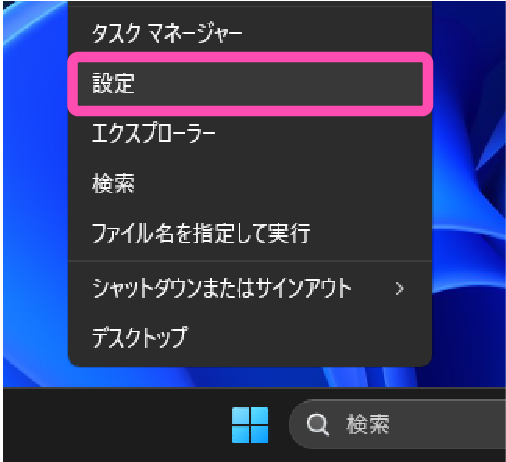
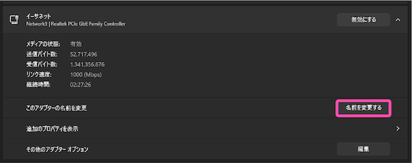
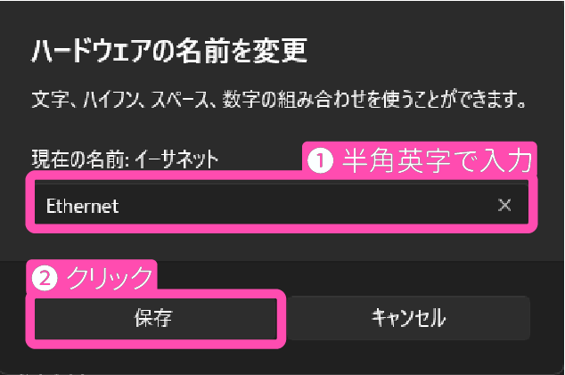

# Multipass 関連のトラブル

---
**目次**

- [(1) Multipass が起動しない](#1)
- [(2) Microsoft Hyper-V が『Unavailable on Home edition」が選択できない](#2)
- [(3) 「指定されたファイルが見つかりません」というエラーが出る](#3)
- [(4) `multipass networks` の出力結果が文字化けする](#4)

---

## Multipass が起動しない <a id="1"></a>

Multipass を起動しようとしたときに、

```
launch failed: Available disk (2273054720 bytes) below minimum for this image (2361393152 bytes)
```

というエラーメッセージが出ることがあります。

これは、PC 中のディスク容量が少なくなっていることを表します。不要なファイルを削除してください。

昨年度版から引き続き入門コースに取り込んでいる場合は、**Docker イメージのキャッシュ**が原因でこのメッセージが出ることがあります。この場合は、

```
docker system prune --volumes
```

をお試しください。

## Microsoft Hyper-V が『Unavailable on Home edition」が選択できない <a id="2"></a>

[https://www.virtualbox.org/wiki/Downloads](https://www.virtualbox.org/wiki/Downloads) より VirtualBox をダウンロード・インストールし、『Oracle VM VirtualBox』を選択して受講を進めてください。

関連：[「Multipass のインストール」の節でまず、Microsoft Hyper-V が『Unavailable on Home edition」と書いてあり、選択できません](https://www.nnn.ed.nico/questions/29536)

## 「指定されたファイルが見つかりません」というエラーが出る <a id="3"></a>

仮想化環境が用意できていない可能性が高いです。

- ・VirtualBox をダウンロードし、インストールしているか確認してください。
  - ・していない場合は [https://www.virtualbox.org/wiki/Downloads](https://www.virtualbox.org/wiki/Downloads) より ダウンロードしてインストールを済ませてください。

関連：[Ubuntu の起動がうまくいきませんでした。(指定されたファイルが見つかりません。と表示されました)](https://www.nnn.ed.nico/questions/29528)

## `multipass networks` の出力結果が文字化けする <a id="4"></a>

この現象は Windows を使っている方向けの説明です。

`multipass networks` の実行結果が以下のように文字化けする場合は、ネットワークアダプター名を日本語から英語にする必要があります。

```shell
Name                      Type      Description
�C�[�T�l�b�g              ethernet  Realtek PCIe GbE Family Controller
```

以下の手順に沿って、ネットワークアダプター名を変更しましょう。

まず、設定を開きます。<br>
画像を参考に、 Windows のアイコンを右クリックしてください。


すると、以下のようなメニューが表示されます。<br>
その中から、設定と書いてある場所をクリックしてください。



すると、以下の画像のように、左側にメニューが表示されます。<br>
この中から、「ネットワークとインターネット」をクリックしてください。


以下の画面が開けたと思います。<br>
画像で示された、「ネットワークの詳細設定」と書かれた部分をクリックしてください。


すると、以下の画像のように、ネットワークアダプターが一覧表示されます。<br>
今回は、ネットワークアダプター名が日本語になっているものを修正したいです。

日本語になっているネットワークアダプターの欄の右側に、画像で示したような下向きの矢印があります。<br>
こちらをクリックしてください。


すると、以下の画像のように、「このアダプター名を変更」と表示されます。<br>
画像で示した、「名前を変更する」の部分をクリックしてください。



半角英字でネットワークアダプター名を入力してください。
基本的に、日本語を英語に直して入力すると良いでしょう。
ここであれば、「イーサネット」ですから、「Ethernet」としていますね。



変更が終わりましたら、画像で示したように、「保存」をクリックしてください。

これでネットワークアダプターが日本語から英に変更されました。

試しに確認してみましょう。

PowerShell 上で、以下のコマンドを実行してください。

```shell
multipass networks
```

すると、先ほど文字化けしていた部分がきちんと表示されているはずです。

```shell
Name                      Type      Description
Ethernet                  ethernet  Realtek PCIe GbE Family Controller
```

これで設定は完了しました。
