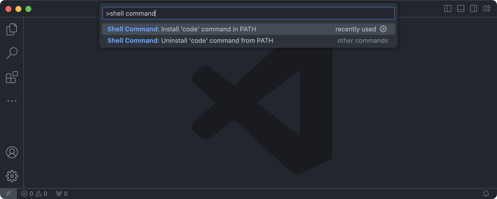
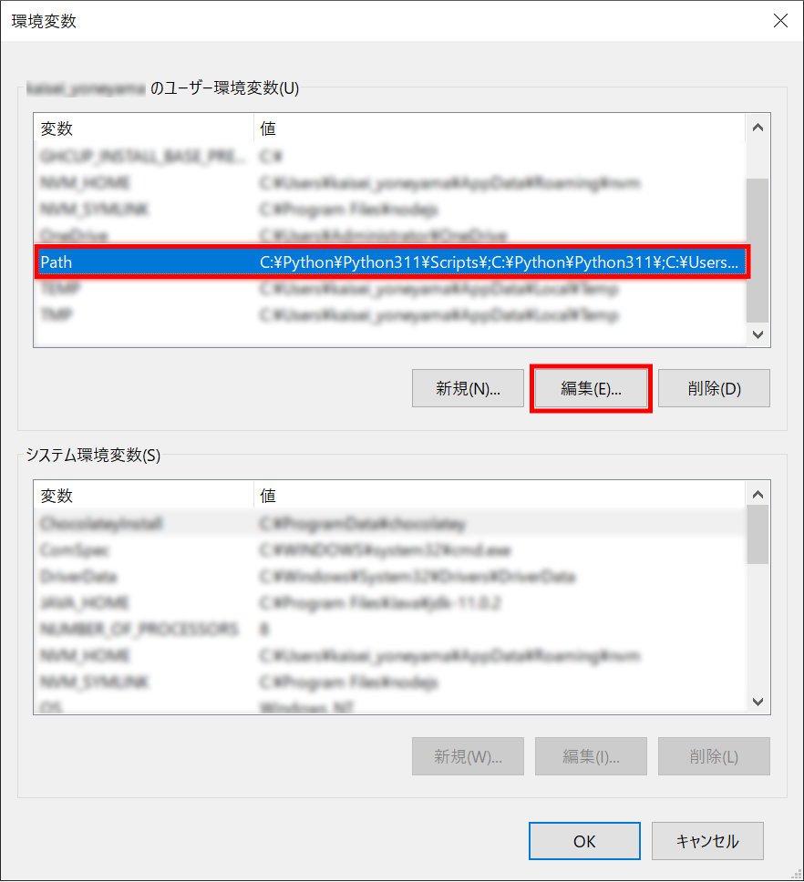
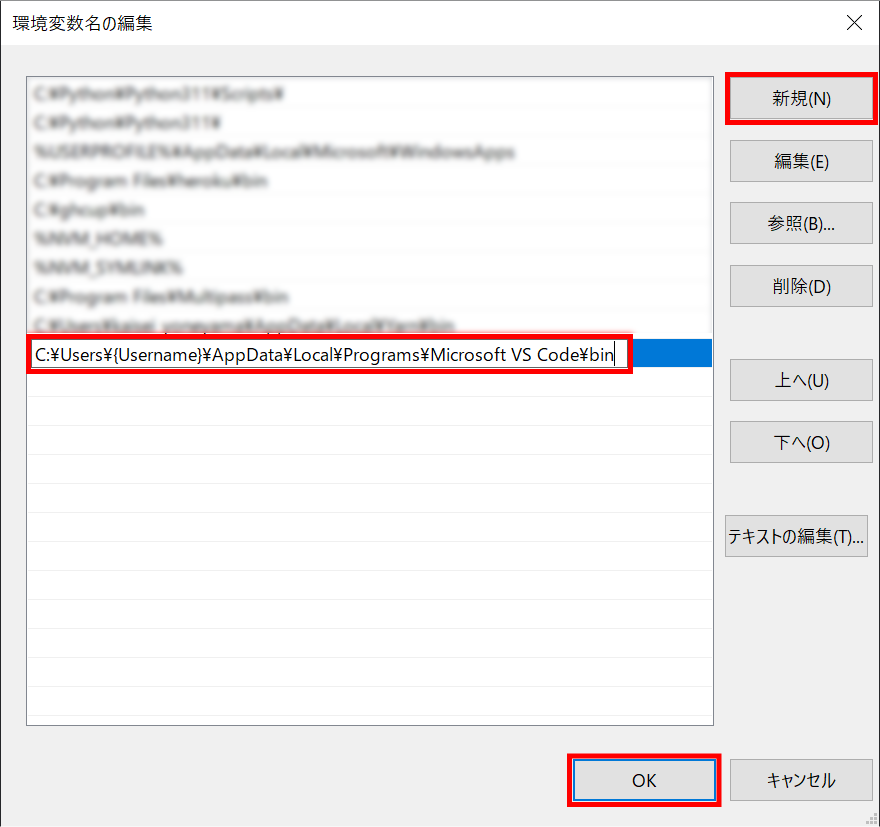

# VS Code のトラブル

---
**目次**
- [(1) アプリケーションフォルダにVisual Studio Code.appがない](#1)
- [(2) html:5と入力しタブキーを押してもテンプレートが表示されない](#2)
  - [(2-1) HTMLファイルとして保存ができていなかった](#2-1)
  - [(2-2) Emmetが有効になっていなかった](#2-2)
- [(3) インストール時、「Visual Studio Code を実行する」のチェックを外さずに完了をしてしまった](#3)
- [(4) VSCodeを使用しようとしたらgitが見つかりませんと表示される](#4)
- [(5) `code` コマンドの設定手順](#5)
---

## (1) インストールしたがアプリケーションフォルダにVisual Studio Code.appがない 

次のページをご覧ください。

- [・VS Codeは開けたのですが、アプリケーションフォルダにVisual Studio Code.appがありませんでした](https://www.nnn.ed.nico/questions/28434)

## (2) html:5と入力しタブキーを押してもテンプレートが表示されない 

テンプレートを作成する際、`html:5` の代わりに `!` と入力することが推奨されるようになりましたが解決策は同じです。

### (2-1) HTMLファイルとして保存ができていなかった 

次のページをご覧ください。

- [・Html:5と入力しタブキーを押してもスペースができるだけで雛形が表示されません](https://www.nnn.ed.nico/questions/27181)

### (2-2) Emmetが有効になっていなかった 

次のページをご覧ください。

- [・vscodeで、html:5でtab押すと展開されるのですか何故か<！DOCTYPE html>は展開されません](https://www.nnn.ed.nico/questions/27330)

## (3) インストール時、「Visual Studio Code を実行する」のチェックを外さずに完了をしてしまった 

次のページをご覧ください。

- [・この①のチェックを外さず完了をしてしまった場合やり直せますか？](https://www.nnn.ed.nico/questions/24568)

## (4) VSCodeを使用しようとしたらgitが見つかりませんと表示される 

次のページをご覧ください。

- [・VSCodeを使用しようとしたらgitが見つかりませんと表示されてしまいます](https://www.nnn.ed.nico/questions/23518)

## (5) `code` コマンドの設定手順 

VS Code の `code` コマンドを設定する手順です。

### macOS

1. VS Code を起動します。
1. <kbd>Command</kbd> + <kbd>Shift</kbd> + <kbd>P</kbd> を押して、コマンドパレットを開きます。
1. <q class="font-bold">shell command</q> と入力して、<q class="font-bold">Shell Command: Install 'code' command in PATH</q> を選択します。  
      
    VS Code を日本語で使用している場合は <q class="font-bold">シェル コマンド: PATH 内に 'code' コマンドをインストールします</q> と表示されます。  
    
1. ターミナルを起動している場合は <code>PATH</code> の値を反映するため再起動してください。

### Windows

Windows では、`code` コマンドは自動的にインストールされています。  
しかし、何らかの理由で `code` コマンドを使用できない場合は次の手順で設定してください。

1. <kbd>Windows</kbd> を押して、そのまま <q class="font-bold">環境変数を編集</q> と入力します。  
    
1. **{Username} のユーザー環境変数(U)** の `Path` を選択して、**編集(E)** をクリックします。  
    
1. **新規(N)** をクリックして、`C:\Users\{Username}\AppData\Local\Programs\Microsoft VS Code\bin` を入力します。  
    入力したら **OK** をクリックして、<q>環境変数名の編集</q> のウィンドウを閉じます。  
    <small>
    `{Username}` はプレースホルダーです。  
    例えばユーザー名が `progedu` の場合は `{Username}` を `progedu` に置き換えてください。
    </small>
    
1. **OK** をクリックして、<q>環境変数</q> のウィンドウを閉じます。  
    
1. PowerShell や Git Bash を起動している場合は <code>PATH</code> の値を反映するため再起動してください。
